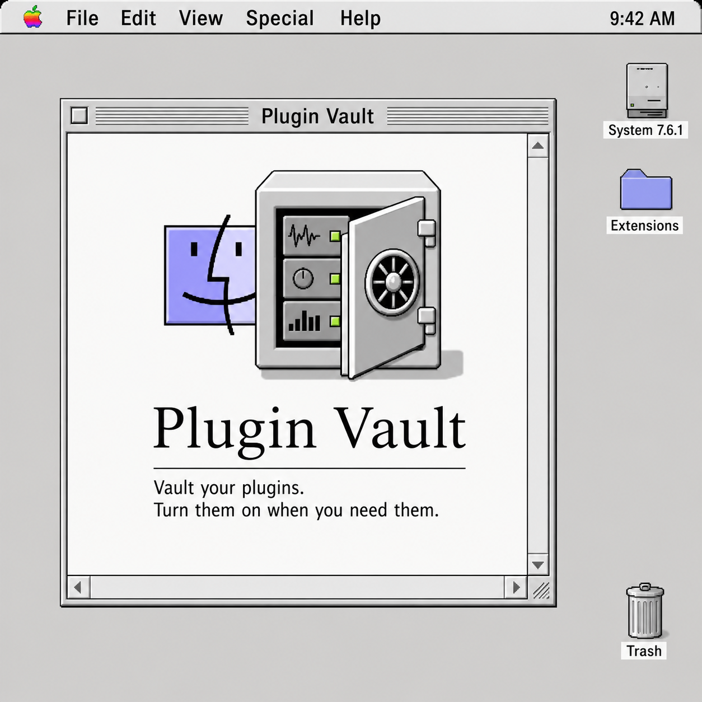

# PluginVault

PluginVault is a beta macOS app for scanning and managing installed DAW plug-ins with a deliberately classic Macintosh System 7-style interface.

<p align="center">
  
</p>

It scans common AU, VST, VST3, and AAX plug-in folders, lets you tag plug-ins using Finder tags, and can vault plug-ins by renaming their bundle directories with a `.vaulted` suffix. Most DAWs ignore the renamed bundles, which makes vaulting useful for temporarily removing plug-ins without deleting them.

## Install

The easiest way to install PluginVault is to download the Mac disk image:

[Download PluginVault v1.0 Beta 1 DMG](https://github.com/water-bear86/PluginVault/releases/download/v1.0-beta.1/PluginVault-v1.0-beta.1.dmg)

Then:

1. Double-click `PluginVault-v1.0-beta.1.dmg`.
2. A small installer window opens.
3. Drag `PluginVault.app` onto the `Applications` shortcut.
4. Open your `/Applications` folder.
5. Control-click `PluginVault.app` and choose `Open`.
6. Click `Open` again if macOS warns that the app is from an unidentified developer.

That Control-click step is only because this beta is development signed and not notarized yet.

### Full Disk Access

PluginVault manages plug-in folders on disk, so macOS may block scans or vaulting until you grant Full Disk Access.

1. Open PluginVault.
2. Open PluginVault Settings.
3. Click `Open Full Disk Access`.
4. In System Settings, turn on PluginVault under Full Disk Access.
5. Quit and reopen PluginVault.
6. Click `Scan`.

All downloadable builds live on the [PluginVault Releases page](https://github.com/water-bear86/PluginVault/releases). If the DMG does not work for you, download `PluginVault-v1.0-beta.1.zip`, unzip it, and drag `PluginVault.app` into `/Applications`.

## Beta Notes

This is an early beta intended for careful local use.

- Back up `/Library/Audio/Plug-Ins` and `~/Library/Audio/Plug-Ins` before bulk vaulting.
- Vaulting changes plug-in bundle names on disk. Use `Unvault All` before deleting the app if you want every discovered plug-in restored.
- The app is intentionally unsandboxed so it can manage system and user plug-in folders.
- macOS may still require Full Disk Access before PluginVault can scan or rename every plug-in bundle.
- The current project deployment target is macOS 26.2.
- The beta package is development signed and not notarized.

## Features

- Scans these default folders:
  - `/Library/Audio/Plug-Ins/Components`
  - `/Library/Audio/Plug-Ins/VST`
  - `/Library/Audio/Plug-Ins/VST3`
  - `/Library/Audio/Plug-Ins/AAX`
  - `~/Library/Audio/Plug-Ins/Components`
  - `~/Library/Audio/Plug-Ins/VST`
  - `~/Library/Audio/Plug-Ins/VST3`
- Shows active, vaulted, tagged, and collection filters in a compact classic sidebar.
- Syncs app tags with macOS Finder tags where permissions allow.
- Vaults untagged plug-ins in bulk.
- Restores all vaulted plug-ins in bulk.
- Builds custom collections from the in-window toolbar.
- Keeps the primary controls inside the app window instead of relying on the macOS menu bar.

## Data

PluginVault stores its local database in:

```text
~/Library/Application Support/PluginVault/database.json
~/Library/Application Support/PluginVault/collections.json
```

Appearance settings are stored in standard macOS user defaults for the app bundle identifier `pluginvault.PluginVault`.

## Development

### Build From Source

You need Xcode installed.

1. Clone the repository:

```sh
git clone https://github.com/water-bear86/PluginVault.git
cd PluginVault
```

2. Build from the command line:

```sh
xcodebuild -project PluginVault.xcodeproj -scheme PluginVault -configuration Debug build
```

3. Or open `PluginVault.xcodeproj` in Xcode and press Run.

### UI Verification

Run the classic UI guard before shipping interface changes:

```sh
./script/verify_classic_ui.sh
```

### Release Packaging

Build a Release app:

```sh
xcodebuild -project PluginVault.xcodeproj -scheme PluginVault -configuration Release -derivedDataPath /tmp/PluginVaultReleaseDerivedData build
```

Release packaging currently produces:

- `PluginVault-v1.0-beta.1.dmg` for drag-to-Applications installs.
- `PluginVault-v1.0-beta.1.zip` as a plain archived app fallback.

## License

The source code is available under the MIT License. See [LICENSE](LICENSE).

The PluginVault name, app icon, screenshots, marketing artwork, and other visual brand assets are not covered by the MIT License. See [NOTICE.md](NOTICE.md).

```text
┌──────────────────────────────────────────────┐
│              Plugin Vault                    │
│                                              │
│         Code by Angus Durrie, ©2026          │
│                                              │
│   If this software brought you joy,          │
│   productivity, or saved you from            │
│   plugin-management hell...                  │
│                                              │
│      feel free to send some internet         │
│              appreciation funds.             │
│                                              │
│   SOL:                                       │
│  4rfSpa3XECkdGRpcB7kgJH16fCCDqZ7CLbGmD6vEq4KM│
│                                              │
│        Support independent software.         │
└──────────────────────────────────────────────┘
```
